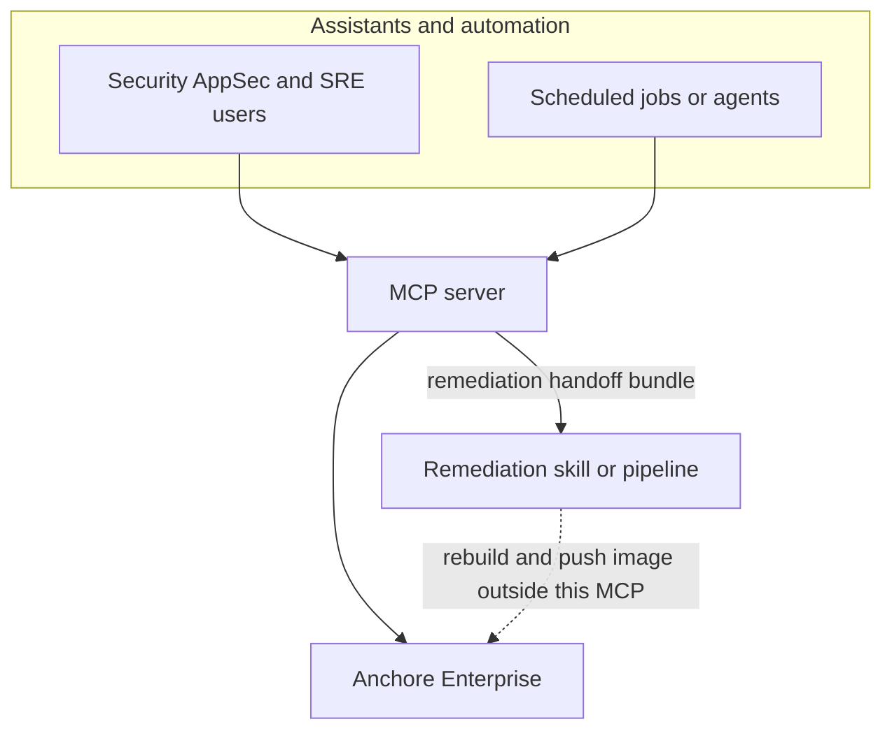

# Anchore Enterprise MCP (AI Assistant Integration)

## Problem Frame

Security and AppSec engineers need **Anchore Enterprise as the system of record** inside assistant workflows: repeatable CVE and image triage, audit evidence, and SBOM/report retrieval. Platform and SRE teams need the same **truth layer** for **scheduled or batch** checks across platform images, with a **clear handoff** to separate automation that can support **downstream remediation** (image rebuilds, CI pushes back into Anchore). **Mapping findings to source repositories** is owned outside this MCP (see R7). Today those flows are often fragmented across UIs, ad hoc scripts, and manual context switching.

This MCP is **not** a remediation, **CI/CD orchestration**, or image-build system; it is the **avenue of insight and Anchore-backed facts** that other skills and pipelines can trust.

## Architecture (conceptual)

Solid lines are in scope for this MCP. The dotted line is **outside** this MCP’s responsibilities; it is shown only to clarify the overall ecosystem.

## Requirements

**Personas and outcomes**

- R1. **Optimize for Security/AppSec** for triage, audit support, and investigation workflows as the primary persona.
- R2. **Support SRE-style usage** as a secondary persona: batch or scheduled queries across images, suitable for nightly or periodic audits, with outputs that can feed **separate** automation.

**Anchore connectivity**

- R3. Each **MCP server process** connects to **exactly one** Anchore Enterprise deployment. Connection settings are **environment variables**: **HTTPS base URL** (required), **API token** authentication per **R12** (required), and an optional **account name** for **account demarcation**; whether account may be omitted and how Anchore behaves are specified in **R12**. Users who need several Anchore deployments configure **several MCP server instances** (each with its own env), not multiple named profiles inside one process. No other authentication methods are in scope for v1 unless explicitly added later.
- R4. **Removed** (superseded by R3): there is no in-process profile list or per-tool profile override. Context switching is achieved by **which MCP entry** the client uses or by restarting the server with different env.

**Core capabilities (v1)**

- R5. Expose **read-oriented** Anchore insight: list and correlate **CVEs and images** (for example CVEs for a given image or scan, and images or artifacts matching CVE criteria), within what the Anchore Enterprise APIs support.
- R6. Support **retrieval of SBOMs and named exports/reports** for evidence and analysis:
  - **SBOM** is the **primary anchor**. SBOM payloads are **JSON only** (no CSV). The MCP must support **three format modes**: **normal**, **SPDX**, and **CycloneDX** (exact Anchore API mapping is deferred to planning/implementation).
  - **Other reports/exports** in scope for v1, by name: **Policy Compliance Export**, **Vulnerability Export**, and **Build Summary**, including **manifest**, **Dockerfile**, and **History** where Anchore exposes them for an image or analysis.
  - **Additional** variants, modes, exports, reports, or adjacent features discovered via Anchore API or documentation during **planning or implementation** are **explicitly welcome** to be considered and added without a new brainstorm, provided they stay **read/export**-aligned with Anchore and remain consistent with **R12–R15**.

**Remediation handoff (v1 must-have)**

- R7. Provide a **first-class remediation handoff** capability: a **dedicated** workflow or output that packages **Anchore-backed identifiers and evidence** for downstream automation. **Determining which source code produced a given image, and which repository or component should be remediated for a given CVE, is the responsibility of image owners and their engineers** (or their own tooling and processes)—**not** this MCP. This MCP **does not** perform remediation, image rebuilds, or **CI/CD orchestration**; downstream systems combine the handoff with org-specific metadata when they need repo routing.

**Operator awareness**

- R8. Tools that **query Anchore** or **retrieve export/report content** must make **non-secret context** clear to the user: **endpoint base URL**, and—when configured—**account name**, and what the tool is doing (summarize the **intended action**) in a way appropriate to the MCP tool result (e.g. leading text or structured fields). **Do not** implement a **custom in-server preview → confirm → execute** loop (no bespoke y/n gate inside this MCP). Rely on **MCP elicitation** where the **host** supports it, and on each **AI IDE’s** own command safety, prompting, and approval UX; those behaviors are **out of scope** to replicate here. Document how context is surfaced and how elicitation applies in `AGENTS.md`.

**Explicitly not required in v1**

- R9. **Upload image** and **trigger scan** (or equivalent write paths that ingest new images into Anchore) are **out of scope for v1**; they may be reconsidered for a later release.
- R10. Any **integration, workflow, or system outside this MCP** (anything not defined as in-scope behavior in this document) is **out of product scope** for v1 and remains the responsibility of consuming teams.

**Documentation and maintainability**

- R11. The repository must be **self-sufficient for future maintainers and AI agents**: include clear guidance (for example `AGENTS.md` and a human-facing README) covering setup, configuration via **environment variables** (`ANCHORE_URL`, `ANCHORE_TOKEN`, optional `ANCHORE_ACCOUNT`), safe handling of credentials, intended tool behavior, **operator context surfacing and elicitation** (R8), **PII: textual chat vs JSON previews vs files; IDE logs/history out of MCP scope** (R14), **export size** (R15), and **documented semantics** for the remediation handoff bundle so external skills can integrate reliably.

**Security and trust**

- R12. **Authentication to Anchore Enterprise** is **presumed** to be **HTTPS** to the configured base URL (`ANCHORE_URL`). For **API token** authentication, the client uses Basic auth where the **`password`** is the **API token** (from `ANCHORE_TOKEN` or equivalent env) and the **`username`** is the **literal string `_api_key`**—that literal is fixed in code, not a user-supplied setting. Optional **account name** comes from **`ANCHORE_ACCOUNT`** (or equivalent) for **account demarcation**; whether that variable may be unset, and how Anchore treats requests when it is unset, must be **validated** against Anchore Enterprise behavior during planning/implementation. Other auth schemes are out of scope for v1 unless explicitly added later.
- R13. **Never** embed secrets in source; credentials and endpoints come from **secure configuration** appropriate for local or enterprise use. **Operational logs** from this MCP (e.g. stderr) must **not** leak secrets; use **token/header redaction** as appropriate. **PII in IDE logs, persisted chat history, and similar host-held data** is **out of scope** for this MCP—the **AI IDE / host** is responsible for those surfaces. **Respect Anchore’s permissions**: effective access is whatever the configured credentials and Anchore RBAC allow.
- R14. **PII handling (MCP textual chat only):** The overall concern is **PII appearing in textual chat** (including from **users**, **schedulers**, or **this MCP**). **This MCP** applies **PII masking** and **explicit warnings** only to **textual** content **it** returns as **chat responses** (prose or unstructured text in tool results). When PII is **detected** there (heuristic or pattern-based, per implementation), apply **masking** and **always** give an **explicit warning**—advise **care in distribution**, and suggest **rotation or revocation** of credentials or identifiers **where appropriate**. **JSON** previews or structured payloads shown in chat **need not** be masked when they are **not** persisted by this MCP to operational logs or history (implementation must not write those previews to MCP logs). **IDE-managed logs, persisted chat history, and content from users or schedulers** are **not** masked by this MCP. **Files** obtained or offered for **download** **may** remain **unmasked**. **Do not** offer `pii_ok`, `allow_pii`, or similar opt-in flags. Document text vs JSON vs files, and detection limits, in `AGENTS.md`.
- R15. **Exports and size:** For exports and large reports, tools must surface the **size** (bytes or human-readable) of the payload—or equivalent metadata—so the user knows what they are receiving. **Bounding** (limits, truncation, or chunking) is left to planning/implementation and must not surprise users without prior indication of size.

## Success Criteria

- A Security/AppSec user can complete a **typical triage loop** (understand CVE exposure for an image, pull SBOM/report evidence, produce a **remediation handoff** for downstream automation) from an assistant **without** using the Anchore UI for those steps.
- An SRE or automation job can run **repeatable fleet-style queries** against a configured Anchore (one per MCP process) and produce **handoff payloads** suitable for **nightly** or periodic review plus remediation routing.
- **Multiple Anchore backends** are supported by running **multiple MCP server configurations** (different env per IDE entry), not by selecting profiles inside one server.
- Tool invocations surface enough **non-secret context** (endpoint, account when set) to recognize mistakes (R8); **confirmation UX** is provided by the **host IDE** and **elicitation**, not a bespoke flow in this MCP.
- A new contributor or AI agent can **install, configure, and extend** the MCP using **only** repository documentation and obvious config patterns.

## Scope Boundaries

- **No** remediation execution, dependency patching, or image rebuild inside this MCP.
- **This MCP does not orchestrate CI/CD**; pipelines and delivery automation are owned by consuming teams.
- **No** mandatory integration with **anything outside this MCP’s in-scope behavior** in v1 (see R10).

## Key Decisions

- **Primary persona:** Security/AppSec; SRE as secondary consumer for batch and audit-style use.
- **v1 must-have handoff:** Remediation skill bundle (first-class, dedicated); **integrations outside this MCP** are out of scope (R10).
- **v1 core Anchore actions:** Read/query CVE and image correlation **plus** SBOM (JSON: normal, SPDX, CycloneDX) and named exports (Policy Compliance Export, Vulnerability Export, Build Summary with manifest/Dockerfile/History where available); **exclude** upload/trigger scan until a later release (R9).
- **Connectivity:** One Anchore per MCP process; **HTTPS** base URL and **`password` = API token** via env (R12), optional **account name** via env (R3, R12); **multiple deployments** = multiple MCP instances (R3–R4).
- **Operator safety:** **Context surfacing** for profile/endpoint/account (R8); **host** handles approval via **elicitation** / IDE UX—**no** custom confirm loop in-server; **PII** masked in **textual MCP chat responses**; **JSON** chat previews and **files** per **R14**; **IDE logs/history** out of MCP scope; **export size** surfaced (R15).

## Dependencies / Assumptions

- **Anchore Enterprise** is available and reachable from the environment where the MCP runs; exact API capabilities and version constraints will be validated during planning.
- **This MCP does not orchestrate CI/CD**; image build, scan-ingestion pipelines, and deployment workflows are external.
- Users who need **write** paths (image upload, scan triggers) will use **Anchore UI, other automation, or a future MCP release** until R9 is revisited.

## Outstanding Questions

### Resolve Before Planning

- None identified at the product-definition level; the following are technical or validation work.

### Deferred to Planning

- [Affects R5–R7][Needs research] Map **concrete Anchore Enterprise API** operations to each tool and to the **remediation handoff** schema (field-level identifiers; **repo routing remains outside this MCP** per R7).
- [Affects R6][Technical] Map **SBOM modes** (normal, SPDX, CycloneDX) and **named exports** (Policy Compliance Export, Vulnerability Export, Build Summary and sub-parts) to Anchore Enterprise endpoints/parameters for the versions you target.
- [Affects R3, R11, R12][Technical] Env var names and validation for **base URL**, token, and optional **account name**; literal **`_api_key`** username when password is the token; whether **account name** may be omitted (Anchore behavior).
- [Affects R8][Technical] Map **elicitation** and **tool descriptions** to **context surfacing** per host; document IDE variance in `AGENTS.md` without prescribing IDE UI.
- [Affects R13–R15][Technical] **PII** heuristics for **textual** chat vs **JSON** previews; ensure MCP **does not** persist JSON previews to logs; **warning** text patterns; stderr **secret** redaction; **size limits** or chunking for large exports.

## Next Steps

→ `/ce:plan` for structured implementation planning grounded in this document.

→ `/ce:work` after a technical plan exists and you are ready to implement.
