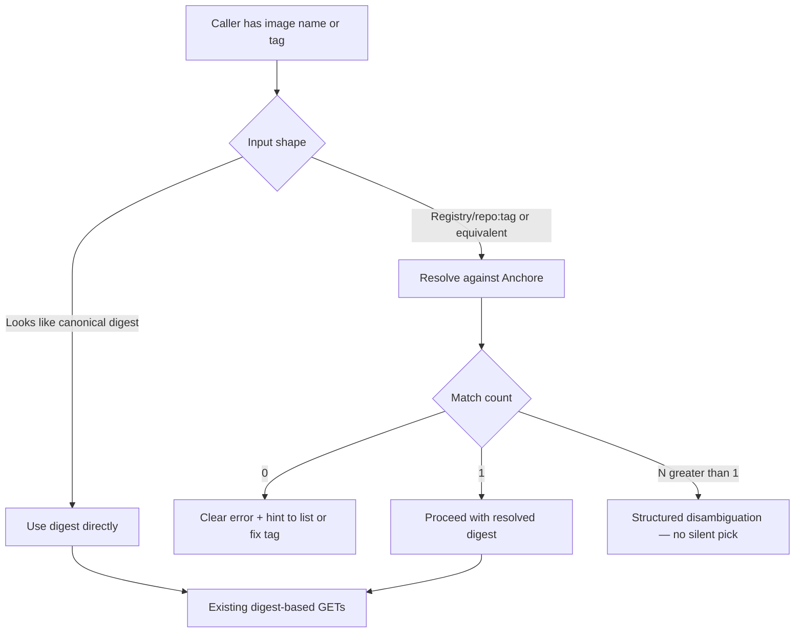

# Image reference and digest resolution (tag-first UX)

## Problem Frame

**Who is affected:** Operators and LLM agents using digest-keyed Anchore v2 tools (`anchore_image_sbom`, `anchore_image_vulnerabilities`, `anchore_image_detail`, `anchore_remediation_handoff`, and related flows). Humans naturally hold **registry/repo:tag** (or short names); Anchore’s per-image routes expect **`sha256:…`** in the path for SBOM, vulns, and detail (see `docs/solutions/best-practices/2026-04-03-anchore-v2-digest-vs-tag-image-apis.md` and `docs/research/anchore-api-notes.md`).

**What is wrong today:** Callers must run **`anchore_list_images`** (often with `fulltag`) or use the UI to obtain a digest, then paste **`image_digest`** into downstream tools. That extra step is easy to get wrong (tag in the digest field → 400/404) and adds friction to the highest-value flows (SBOM, vulns, handoff).

**Why it matters:** Reducing digest copy-paste and making **names/tags the primary input** improves correctness, speed, and alignment with how people already talk about images—without changing Anchore’s API contract (still digest-centric under the hood).

## User flow (conceptual)

Prose is authoritative if this diagram and later requirements diverge. The chart shows **catalog match cardinality** (0 / 1 / N) only; **transport, auth, and validation** outcomes are covered in **R4** and are not depicted as separate branches here.

## Requirements

Requirement IDs (**R1–R9**, **R10**) are grouped by theme, not strict numeric order in the file: **R10** (OpenAPI pagination) appears after **R1–R3** because it cross-cuts the HTTP client and is referenced from **R3**, Success Criteria, and Deferred items.

**Unified input and compatibility**

- R1. Digest-keyed tools must accept a **human-oriented image reference** in addition to (or in place of) a bare digest, so callers can start from **names/tags** without a separate manual lookup when resolution succeeds. The exact parameter shape (single combined field vs digest + optional reference) is a planning detail; behavior must preserve **backward compatibility** with existing **`image_digest`**-only calls.
- R2. When the caller supplies a string that is unambiguously a **canonical digest** (e.g. `sha256:` prefix per deployment norms), the implementation **must not** treat it as a tag for list resolution—use it as the path key directly.
- R3. **Resolution** must prefer **server-side narrowing** when the Anchore deployment supports it (public MCP input `fulltag`, translated to documented wire parameter `full_tag` on `GET /v2/images`) before falling back to broader list strategies documented at planning time. Where resolution requires walking list results, **R10** applies so scans are not truncated at the first page.

**HTTP client and OpenAPI contract**

- R10. **Pagination:** For Anchore routes where **`GET /v2/openapi.json`** on that deployment documents **paged** result sets (collection endpoints—not typical single-resource `GET /v2/images/{digest}` bodies), the MCP’s HTTP client **must** align with that contract. Where the spec defines **pagination** (e.g. `limit` / `page` / cursor-style query parameters, continuation tokens, `next` / `next_page` fields, total counts, or RFC 5988 `Link` headers), the client **must** iterate or compose requests until the **logical operation** for that tool is complete, subject to **documented caps** (max pages, max items, timeouts) fixed in planning so calls cannot run unbounded. A **single HTTP response must not** be treated as the full set when the OpenAPI document indicates paged results. This applies at minimum to **`anchore_list_images`** and to **tag/reference resolution** that searches or enumerates list responses; it applies to **any other MCP tool** in this codebase that calls such a paginated route (including new list-style tools added later—each must satisfy R10 when it hits a paged collection). Parameter names and response shapes are **not** hardcoded for all deployments—they are **derived from or verified against** the published spec for the connected host. **OpenAPI retrieval:** Use the spec document that matches **`ANCHORE_API_VERSION`** and the configured base URL (e.g. **`/v2/openapi.json`** for v2). Treat the fetch like other Anchore HTTPS calls: **same origin as `ANCHORE_URL`**, bounded response size and timeouts, **do not follow redirects to a different host**, and **do not** log full OpenAPI bodies to stderr (operational hygiene aligns with R13/R14 discipline). **Caps vs match outcomes:** If iteration stops because of caps **before** the enumerated pages cover the slice of catalog needed to know match cardinality, the tool **must not** report a plain **R4** “no match” or proceed under **R6** “exactly one match” when that conclusion depends on unseen pages. Return an explicit **enumeration incomplete** state (distinct from **R4**), with guidance to narrow **`fulltag`**, raise limits, or retry—unless the operation is provably complete within scanned pages (e.g. filtered list is bounded and fully retrieved per spec). **Incomplete signals:** **R5** “`truncated`” for capped **disambiguation candidate lists** is a separate concern from **enumeration incomplete** due to **R10** pagination caps; use distinct machine-readable fields or clearly scoped flags so callers do not conflate “too many candidates to list” with “catalog not fully scanned.”

**Ambiguity and errors**

- R4. **Zero matches:** Return a **clear, non-ambiguous error** that states no analyzed image matched the reference and points the user toward **`anchore_list_images`** or correcting the tag—without leaking secrets (R14/R8 patterns unchanged). **Upstream errors:** Distinguish “no match in catalog” (R4) from transport/auth failures (timeouts, 401/403, non-JSON errors)—do not present those as zero-match. **Validation:** Reject obviously malformed reference strings (e.g. length limits, control characters) before calling Anchore; apply safe URL encoding for query parameters.
- R5. **Multiple matches:** Return a **structured disambiguation result** (e.g. candidate digests and associated tags/metadata available from list/detail) and **do not** silently choose a digest. **Dedupe:** Normalize candidates by **digest** first—if multiple list rows map to one digest, treat as a single logical image for match counting unless product explicitly needs per-tag rows in the payload. The caller must either narrow the reference or pass an explicit digest. **Truncation:** If the candidate set is capped, the payload **must** indicate incompleteness (e.g. `truncated: true`) so callers do not treat the list as exhaustive.
- R6. **Exactly one match:** Proceed to the existing digest-based HTTP calls using the resolved digest. The tool result should include the **resolved digest** in machine-readable context so downstream steps and transcripts stay auditable.

**Scope of tools**

- R7. At minimum, **SBOM** and **vulnerabilities** flows must support the unified reference model, because they are the most common “I have a tag” paths. **Image detail** and **remediation handoff** should use the **same** input model for consistency. If planning phases the work, **Milestone 1** must still cover **SBOM + vulnerabilities**; detail and handoff may follow in a later milestone only if the plan records an explicit rationale (risk, dependency, or test load)—not by default.
- R8. **Policy check** already accepts optional **`tag`** for **evaluation context** on `GET .../check`. The **path digest** (whether user-supplied or **resolved** from a reference) is not interchangeable with that query **`tag`**. Planning must name parameters so a single string never silently serves both roles—for example: resolved digest for the path, and a **separate** optional field for policy evaluation tag when Anchore requires it. Documented behavior must match `docs/solutions/best-practices/2026-04-03-anchore-v2-digest-vs-tag-image-apis.md` (tag may qualify `/check`, not replace digest for SBOM). **Milestone:** Unified reference for the **path digest** on policy check may ship **with** SBOM + vulns or in the **same** follow-on milestone as detail/handoff—planning must record the choice; R8 guardrails apply whenever that tool gains unified inputs.

**Documentation and knowledge**

- R9. Public operator docs (e.g. `README.md`) and tool descriptions must state that **Anchore remains digest-centric at the HTTP layer** and that the MCP performs **resolution** for UX—not that Anchore accepts tags on SBOM routes natively.

## Success Criteria

- A user (or agent) can request an SBOM or vulnerability list starting from a **full tag string** they use in daily work, without manually copying a digest, when that tag maps to **exactly one** analyzed image in the connected Anchore account.
- When resolution is impossible or ambiguous, the user gets **actionable** errors or a **disambiguation payload**, not opaque HTTP 400/404 from mis-placed tags in path segments.
- Existing workflows that pass **`sha256:…` digests** continue to work unchanged.
- **MVP vs later:** If image detail and remediation handoff do not ship in the same milestone as SBOM + vulnerabilities, success for that milestone is still met when those two flows meet the criteria above; detail and handoff then become explicit follow-on success criteria when their milestone ships (see Key Decisions).
- **Pagination:** For deployments whose OpenAPI defines paged list (or similar) responses, **list**, **resolution**, and **any other tool** that calls such a route do not **silently** treat the first page as the full result set, and surface **enumeration incomplete** per **R10** when caps stop the scan early (see **R10**).

## Scope Boundaries

- **Not in scope:** Changing Anchore Enterprise API semantics, adding new Anchore server features, or guaranteeing resolution when the image was never analyzed in Anchore.
- **Not in scope:** Caching resolution across tool calls in a persistent server-side store (session-only or implicit caching may be considered in planning; durable cache is out unless explicitly added later).
- **Not in scope:** Resolving arbitrary short names without registry context when that would require guessing—product may require **fully qualified** `registry/repo:tag` or document deployment-specific conventions.

**Input examples (normative for tests, not an implementation checklist):**

| Input | Expected treatment |
|-------|---------------------|
| `sha256:abcdef…` | Treat as digest (R2); no list resolution. |
| `docker.io/library/nginx:1.21` | Resolve via list/public `fulltag` translated to wire `full_tag` (or equivalent); then 0/1/N rules. |
| `nginx:1.21` (short) | **Unspecified** in this doc—planning chooses: reject, pass through as opaque `fulltag` string, or require user to qualify—must be consistent and documented. |

## Key Decisions

- **OpenAPI is normative for HTTP behavior:** Pagination (R10), query parameter names, and response wrappers follow the deployment’s **`/v2/openapi.json`**, not a single hardcoded v2 snapshot in code.
- **Digest remains the wire format to Anchore:** Resolution is an **MCP-side convenience** layered on existing list/detail endpoints; it does not imply tags in SBOM URL paths.
- **No silent disambiguation:** Multiple matches always surface as structured choice, not a heuristic pick (e.g. “latest” by time) unless explicitly revisited in a future brainstorm.
- **MVP vs follow-up:** The **first shippable** behavior must include **SBOM + vulnerabilities** (R7 minimum). **Detail** and **handoff** are **strongly preferred** in the same release; deferring them requires an explicit note in the implementation plan.

## Dependencies / Assumptions

- List and image records return enough **tag and digest fields** to match references; field names vary by version—planning must align with `GET /v2/openapi.json` for the target deployment.
- The deployment’s OpenAPI document (URL follows **`ANCHORE_API_VERSION`**, e.g. **`GET …/v2/openapi.json`** for v2) defines which routes are paginated and how; the MCP must consume that contract per **R10** (implementation may cache or pin a fragment for tests; runtime behavior must match the connected host). If **`ANCHORE_API_VERSION=v1`**, use the spec that describes the v1 routes actually called, or scope **R10** to routes documented as paginated in that spec.
- `anchore_list_images` with public **`fulltag`** remains a valid primary resolution mechanism where supported; the HTTP request uses **`full_tag`**.

## Outstanding Questions

Planning may start without resolving every item below; items are **worked during planning**, not necessarily blockers to opening a plan.

### Deferred to Planning

- [Affects R1][Technical] Exact Zod shape: single `image` string vs `image_digest` + optional `image_reference`, and mutual-exclusion rules.
- [Affects R2][Product] Default behavior for **short** references (e.g. `nginx:1.21` without registry): reject, pass through as opaque `fulltag`, or require qualification—must match the Input examples table once chosen.
- [Affects R3][Needs research] Whether any deployment supports additional `GET /images` query filters beyond public `fulltag` (wire `full_tag`) / `vulnerability_id` that should participate in resolution for fewer false multi-matches; behavior when `full_tag` is ignored or partially applied (verify against OpenAPI; bounded fallback and failure mode). Do not assume `registry`, `repository`, or `repo` filters unless the deployment OpenAPI advertises them for this operation.
- [Affects R10][Technical] Exact pagination loop per OpenAPI (parameter names, response field for next cursor, `Link` header parsing if used); **caps** (max pages/items/elapsed time) for list tools and for internal resolution; whether **`anchore_list_images`** exposes optional cursor/limit to callers or only uses them internally; **when** to fetch or cache OpenAPI (per lazy connection model in `AGENTS.md`); fetch **TTL** / invalidation on auth errors.
- [Affects R5][Technical] Maximum number of candidates to return in disambiguation, slim projection fields, and sort order when truncated.
- [Affects R6][Technical] Optional **preflight** `GET /v2/images/{digest}` (or equivalent) after resolution when list-to-detail drift could cause downstream 404—planning decides if required or best-effort.

## Next Steps

→ `/ce:plan` for structured implementation planning when ready.

## Alternatives Considered

| Approach | Pros | Cons | Outcome |
|----------|------|------|--------|
| A. New **`anchore_resolve_image`** only; callers chain tools | Transparent, easy to debug | Two round-trips; worse LLM UX | **Optional** adjunct: useful for debugging, not sufficient alone for “tag-first” UX. |
| B. Composite tools only (e.g. SBOM-for-tag) | One call for SBOM | Duplication across vuln/detail/handoff | **Rejected** as sole approach; inconsistent surface. |
| C. Unified reference input on each digest-keyed tool (per R1, R7) | One pattern everywhere; reuses one resolver | Slightly more implementation surface | **Preferred** baseline; combine with small shared helper internally. |

## Related

- Ideation: `docs/ideation/2026-04-03-anchore-mcp-v2-ideation.md` (survivor #2).
- API research: `docs/research/anchore-api-notes.md` (deployment **`/v2/openapi.json`** is source of truth for pagination and parameters).
- Digest vs tag: `docs/solutions/best-practices/2026-04-03-anchore-v2-digest-vs-tag-image-apis.md`.
