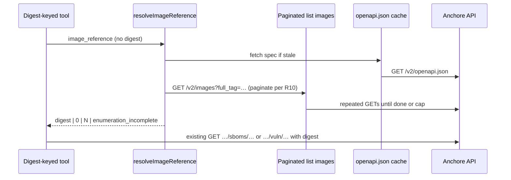

# feat: Image reference resolution, OpenAPI pagination, unified digest-keyed tool inputs

## Overview

Implement **tag/reference → digest resolution** inside the MCP (see origin), **OpenAPI-aligned pagination** for list-style Anchore calls (especially `GET` list images), and **unified tool inputs** so digest-keyed tools accept either an existing **`sha256:…`** digest or a **human-oriented image reference** string, without changing Anchore’s digest-centric HTTP paths. Operator docs and tool descriptions will state that resolution is an MCP convenience (R9).

**Planning posture:** Standard depth; execution is **test-first friendly** for new resolver and pagination helpers (high regression risk on URL shapes and 0/1/N outcomes).

## Problem Frame

Operators and agents think in **registry/repo:tag**; Anchore v2 per-image routes require **digest in the path**. Today callers must list images or use the UI to obtain a digest, then call SBOM/vulns/detail/handoff—easy to mis-copy and frustrating. The origin document defines behavior for **0 / 1 / N** matches, **enumeration incomplete** when pagination caps stop the scan before cardinality is knowable, and **distinct** incompleteness signals for **R5** disambiguation truncation vs **R10** pagination (see origin).

## Requirements Trace

| Origin | Plan coverage |
|--------|----------------|
| R1–R3 Unified input, digest detection, public `fulltag` / wire `full_tag` preference, R10 for walks | Units 2–5 |
| R10 OpenAPI pagination, same-origin spec fetch, caps, enumeration incomplete | Unit 1–2, 3 |
| R4–R6 Errors, disambiguation, resolved digest in context | Units 3–5 |
| R7 SBOM + vulns MVP; detail + handoff + policy same release strongly preferred | Units 4–5 |
| R8 Policy path digest vs evaluation `tag` | Unit 5 |
| R9 README / tool descriptions | Unit 6 |

## Scope Boundaries

- **In scope:** MCP-side resolution, pagination for **`anchore_list_images`** and internal resolution enumerations, Zod/tool schema updates for listed tools, tests, README.
- **Out of scope:** Changing Anchore server behavior; durable cross-call cache of resolution (origin); guaranteeing resolution for images never analyzed in Anchore.
- **Short names (`nginx:1.21` without registry):** **Resolved during planning:** default is **reject with validation error** and message to pass a **fully qualified** `registry/repo:tag`, consistent with origin scope boundaries and simplest agent behavior. Implementation may allow pass-through as opaque `fulltag` only if tests prove it matches operator expectations—otherwise stay strict FQDN for the reference field.

## Context & Research

### Relevant Code and Patterns

- `src/anchore/client.ts` — `getJson` / `getJsonWithByteLength`; single GET per call; no retries; auth + `x-anchore-account`.
- `src/anchore/api-paths.ts` — `imagesListPath`, SBOM/vuln/detail/check paths.
- `src/tools/images.ts` — list with `fulltag` / `vulnerability_id`; one request; `summarizeImages` handles `images` / `items` / array.
- `src/tools/sbom.ts`, `vulnerabilities.ts`, `reports.ts`, `remediation-handoff.ts` — digest in path; policy + handoff already take optional **`tag`** for `/check` context (keep orthogonal to resolved path digest per R8).
- `src/mcp/server.ts` — tool registration and Zod schemas.
- Tests: inject `connection` + `fetch` mock; assert URLs and `formatAnchoreToolJson` payloads.

### Institutional Learnings

- `docs/solutions/best-practices/2026-04-03-anchore-v2-digest-vs-tag-image-apis.md` — digest in path; policy `tag` is query context, not SBOM path substitute.
- `docs/solutions/integration-issues/2026-04-02-anchore-v2-image-sbom-sboms-path.md` — plural **`sboms`** segment.
- `docs/research/anchore-api-notes.md` — `/v2/openapi.json` as deployment truth.

### External References

- Deployment **`GET …/v2/openapi.json`** — pagination parameter names and response continuation fields vary; plan assumes **fixture-driven tests** plus **manual verification** on a real Enterprise host before declaring full compatibility.

**External research:** Skipped for codegen—local HTTP patterns and Anchore deployment OpenAPI are the source of truth; high-risk areas covered by tests and caps.

## Key Technical Decisions

- **Tool parameter shape (R1):** For each digest-keyed tool, accept **`image_digest`** (optional) **xor** **`image_reference`** (optional string, FQDN `registry/repo:tag` per planning default). If **`image_digest`** is present and non-empty, use it as today (R2). If only **`image_reference`** is present, run resolver. If both empty or both provided, validation error with one clear message. *(Directional: single combined `image` field was rejected in favor of explicit backward-compatible names.)*
- **Digest detection (R2):** Treat as digest when the string matches a **canonical digest** rule implemented in one shared helper (e.g. `sha256:` prefix + hex, length bounds); tune in implementation with tests for false positives/negatives.
- **OpenAPI fetch:** **Lazy** on first need for pagination or resolver (aligns with `AGENTS.md` lazy connection). **GET** `{baseUrl}{/v2|/v1}/openapi.json` per `ANCHORE_API_VERSION`. **Same origin** as `ANCHORE_URL`; **do not** follow redirects to other hosts; **bounded** response size; **no** full spec on stderr. In-memory cache with **TTL** (e.g. 5–15 minutes) and **invalidate** on auth failure from Anchore; exact TTL **deferred to implementation** with env override optional.
- **Pagination implementation:** **Staged:** (1) Implement a **bounded iterator** that can loop `GET /v2/images` (and v1 list if needed) using **continuation** discovered from **OpenAPI-derived or heuristic** rules: read OpenAPI JSON for the list operation, extract query params for page/limit/cursor and response fields for next token; if spec is ambiguous, support **tested** patterns for common Enterprise shapes (`next`, `next_page`, `Link` rel=next) documented in code comments. (2) **Do not** ship a full generic OpenAPI client generator in v1 of this feature unless effort stays small—prefer **targeted** list-route support with tests.
- **Caps (R10):** Defaults fixed in code (and optionally env): e.g. max pages, max total rows scanned, max wall time for resolution enumeration. When caps hit before cardinality is known → **`enumeration_incomplete`** (or equivalent stable code) in machine-readable JSON, **not** plain R4 zero-match or R6 success.
- **R5 vs R10 flags:** Use **different** JSON fields or namespaced keys: e.g. `disambiguation_truncated` vs `enumeration_incomplete` so callers cannot conflate (per origin).
- **Policy (R8):** Resolved digest populates **path**; existing optional **`tag`** field remains **only** for Anchore `/check` evaluation context—never auto-fill from `image_reference` without explicit user intent (document in tool description).
- **Milestone:** **Unit 4** (SBOM + vulns) is MVP; **Unit 5** (detail, handoff, policy) lands in the **same delivery** unless schedule forces a follow-up PR—origin strongly prefers same release.

## Open Questions

### Resolved During Planning

- **Short reference strings:** Reject non-FQDN by default; document in README.
- **Parameter names:** `image_digest` + `image_reference` mutual exclusivity with `image_digest` taking precedence if both supplied is **invalid**—prefer **reject both** rather than silent precedence.

### Deferred to Implementation

- Exact OpenAPI JSON parse library vs minimal `JSON.parse` + path walking.
- Optional env vars: `ANCHORE_LIST_MAX_PAGES`, `ANCHORE_OPENAPI_CACHE_MS`, etc.
- Optional preflight `GET /v2/images/{digest}` after resolve (origin deferred)—implement if flaky 404s appear in integration tests.

## High-Level Technical Design

> *This illustrates the intended approach and is directional guidance for review, not implementation specification. The implementing agent should treat it as context, not code to reproduce.*

**Resolver outcomes (conceptual):** `ok_digest` | `no_match` | `disambiguate` (candidates + optional `disambiguation_truncated`) | `enumeration_incomplete` | `upstream_error` — map to `formatAnchoreToolJson` + R8 `context`.

## Implementation Units

- [x] **Unit 1: OpenAPI fetch cache + paginated list collection helper**

**Goal:** Same-origin OpenAPI document retrieval with caching/TTL and a **bounded** helper to walk **paged** `GET` list responses for the images list route per **R10**, stopping correctly when the spec says the collection is complete or when caps trigger **enumeration incomplete**.

**Requirements:** R10 (pagination, OpenAPI retrieval rules, caps vs outcomes), origin Dependencies.

**Dependencies:** None.

**Files:**
- Add: `src/anchore/openapi-fetch.ts` (or similar) — fetch, cache, invalidate.
- Add: `src/anchore/list-images-pages.ts` (or similar) — iterator using `AnchoreClient` + connection.
- Add tests: `src/anchore/openapi-fetch.test.ts`, `src/anchore/list-images-pages.test.ts` (mock `fetch`).
- Modify: `src/anchore/client.ts` only if shared helpers need hooks (keep changes minimal).

**Approach:** Parse OpenAPI JSON enough to discover **list route** query/response pagination for `GET` images; fall back to **documented heuristics** for common field names when spec is thin. Enforce **max pages / max items / timeout**; return structured **incomplete** result to callers.

**Patterns to follow:** Existing `AnchoreClient` auth and HTTPS; no secrets in logs (R13).

**Test scenarios:**
- **Happy path:** Mock OpenAPI + two-page list; iterator returns merged items or yields pages per design; last page detected per spec.
- **Edge case:** Single-page list, OpenAPI says not paginated — one GET only.
- **Error path:** OpenAPI fetch non-JSON / 404; list GET fails mid-pagination; cap exceeded → incomplete signal, not success.
- **Integration:** Mock `fetch` sequence OpenAPI → list page1 → list page2 with auth headers preserved.

**Verification:** Helper usable from list tool and resolver; tests green.

---

- [x] **Unit 2: `resolveImageReference` core**

**Goal:** Single module that given **`image_reference`** returns resolver outcome: canonical **digest** for downstream paths, **no match**, **disambiguation** list (deduped by digest per R5, slim fields, optional truncation flag), or **enumeration incomplete** per R10 caps. Includes **digest classifier** for R2.

**Requirements:** R1–R6, R3 (public `fulltag` translated to wire `full_tag` first), R10 (delegate to Unit 1 for list walk).

**Dependencies:** Unit 1.

**Files:**
- Add: `src/anchore/resolve-image-reference.ts` (or `src/tools/image-reference.ts` if preferred—prefer `anchore/` for reuse).
- Add: `src/anchore/resolve-image-reference.test.ts`.

**Approach:** Validate FQDN-ish reference (planning default); `URLSearchParams` / encoding per R4; call the paginated list with wire parameter `full_tag`; extract digest + tag fields from `items`/`images` rows using shared normalization (reuse or extend `summarizeImages` extraction logic in a small `image-records.ts` helper if needed).

**Patterns to follow:** `docs/solutions` digest vs tag; no tag in SBOM path.

**Test scenarios:**
- **Happy path:** One matching row after the `full_tag` wire filter → digest.
- **Edge case:** Multiple rows same digest different tags → count as one (R5 dedupe).
- **Error path:** Zero matches → structured `no_match` (not HTTP raw).
- **Error path:** Multi digest disambiguation; truncated candidate list sets `disambiguation_truncated`.
- **Error path:** Pagination stops early → `enumeration_incomplete` without claiming R4/R6.

**Verification:** Pure tests with mocked client/list behavior cover all outcome types.

---

- [x] **Unit 3: `anchore_list_images` uses pagination + optional caller controls**

**Goal:** User-facing list tool returns **full logical result** for default calls (merge pages) **or** surfaces continuation metadata if origin product choice is to expose cursors—**minimum** is correct merged list for default invocations per R10. Optionally add Zod params for `limit`/`page`/`cursor` **if** OpenAPI documents them and tests confirm.

**Requirements:** R10, Success Criteria (pagination).

**Dependencies:** Unit 1.

**Files:**
- Modify: `src/tools/images.ts`
- Modify: `src/tools/images.test.ts`
- Modify: `src/mcp/server.ts` (Zod for new optional params if any)

**Approach:** Replace single `getJson` with paginated helper from Unit 1 for default behavior; preserve public `fulltag` (translated to wire `full_tag`) and `vulnerability_id` behavior.

**Test scenarios:**
- **Happy path:** Two-page list merged; summary line count correct.
- **Edge case:** Empty list all pages.
- **Error path:** Enumeration incomplete surfaces in tool JSON when caps hit (if applicable to list tool—if only resolver uses caps, document that list tool uses higher caps or full merge for “list all”).

**Verification:** Mock multi-page; existing tests updated.

---

- [x] **Unit 4: SBOM + vulnerabilities — unified input**

**Goal:** Extend **`anchore_image_sbom`** and **`anchore_image_vulnerabilities`** to accept **`image_reference`** per Key Technical Decisions; run resolver when reference provided; pass resulting digest to existing HTTP paths; include **resolved digest** in R8 context (R6).

**Requirements:** R1, R2, R6, R7 MVP.

**Dependencies:** Unit 2.

**Files:**
- Modify: `src/tools/sbom.ts`, `src/tools/sbom.test.ts`
- Modify: `src/tools/vulnerabilities.ts`, `src/tools/vulnerabilities.test.ts`
- Modify: `src/mcp/server.ts` — Zod schemas and descriptions.

**Approach:** Shared small wrapper: `resolveOrUseDigest(args, connection)` returning `CallToolResult` early on disambiguation/errors, else digest string for existing `run*` body.

**Test scenarios:**
- **Happy path:** `image_reference` resolves → same downstream URL as digest-only test.
- **Edge case:** Digest-only unchanged (regression).
- **Error path:** Disambiguation returns structured JSON, not thrown Anchore 404.
- **Error path:** `enumeration_incomplete` distinct from vuln/SBOM HTTP errors.

**Verification:** Tests mirror origin matrix; no stderr secret leaks.

---

- [x] **Unit 5: Image detail, remediation handoff, policy check — unified path digest**

**Goal:** Same **`image_digest` / `image_reference`** pattern for **`anchore_image_detail`**, **`anchore_remediation_handoff`**; for **`anchore_image_policy_check`**, resolved digest fills **path**; **optional `tag`** remains explicitly for `/check` query—do not merge with reference string (R8). Update `run*` functions and tests.

**Requirements:** R7–R8, R6.

**Dependencies:** Unit 2.

**Files:**
- Modify: `src/tools/reports.ts`, `src/tools/reports.test.ts` (or split test files if already large)
- Modify: `src/tools/remediation-handoff.ts`, `src/tools/remediation-handoff.test.ts`
- Modify: `src/mcp/server.ts`

**Approach:** Same resolver wrapper as Unit 4; policy schema/description clarifies dual tag roles.

**Test scenarios:**
- **Happy path:** Handoff with `image_reference` matches digest-only bundle shape.
- **Edge case:** Policy with `image_reference` + explicit `tag` for check both set intentionally.
- **Error path:** Resolver errors before composite calls—no partial handoff JSON.

**Verification:** Regression suite for existing digest-only handoff.

---

- [x] **Unit 6: Documentation and operator clarity (R9)**

**Goal:** README section: Anchore digest-centric HTTP; MCP resolution; FQDN requirement; pagination behavior summary; optional env for caps/TTL if implemented. Tool descriptions in `server.ts` updated for new fields and error semantics.

**Requirements:** R9.

**Dependencies:** Units 4–5.

**Files:**
- Modify: `README.md`
- Modify: `env.example` if new optional env vars added
- Modify: `src/mcp/server.ts` tool description strings
- Optional: `docs/research/anchore-api-notes.md` one-line cross-link to new behavior

**Test scenarios:** **Test expectation: none** — doc-only unless README is CI-checked (if not, manual review).

**Verification:** Reviewer can configure MCP from README alone; no claim that Anchore accepts tags on SBOM routes.

## System-Wide Impact

- **Interaction graph:** All digest-keyed tools share resolver; list tool shares pagination helper with resolver.
- **Error propagation:** Resolver failures return **structured** tool errors before Anchore SBOM/vuln/detail calls—avoid leaking raw Anchore HTML/JSON to model-facing text except in controlled `anchore` payload.
- **API surface parity:** Every digest-keyed tool gains consistent optional reference input pattern.
- **Unchanged invariants:** **`ANCHORE_*` env**, stdio MCP, one deployment per process, R13/R14 logging rules.

## Risks & Dependencies

| Risk | Mitigation |
|------|------------|
| OpenAPI shape differs widely across Enterprise versions | Fixture tests + document “verify on deployment”; staged heuristics; optional manual `openapi.json` snapshot in testdata |
| Full-catalog walks are slow | Default `fulltag` narrowing; strict caps; clear `enumeration_incomplete` |
| LLM passes both digest and reference | Validation error (resolved in planning) |
| Policy `tag` confused with reference | Explicit parameter names and tool docs (R8) |

## Documentation / Operational Notes

- Update README for new tool parameters and troubleshooting (400 vs resolution outcomes).
- Consider short “migration” note: callers can keep using `image_digest` only.

## Sources & References

- **Origin document:** [docs/brainstorms/2026-04-03-image-reference-digest-resolution-requirements.md](../brainstorms/2026-04-03-image-reference-digest-resolution-requirements.md)
- Related: [docs/ideation/2026-04-03-anchore-mcp-v2-ideation.md](../ideation/2026-04-03-anchore-mcp-v2-ideation.md)
- Code: `src/anchore/client.ts`, `src/tools/*.ts`, `src/mcp/server.ts`
